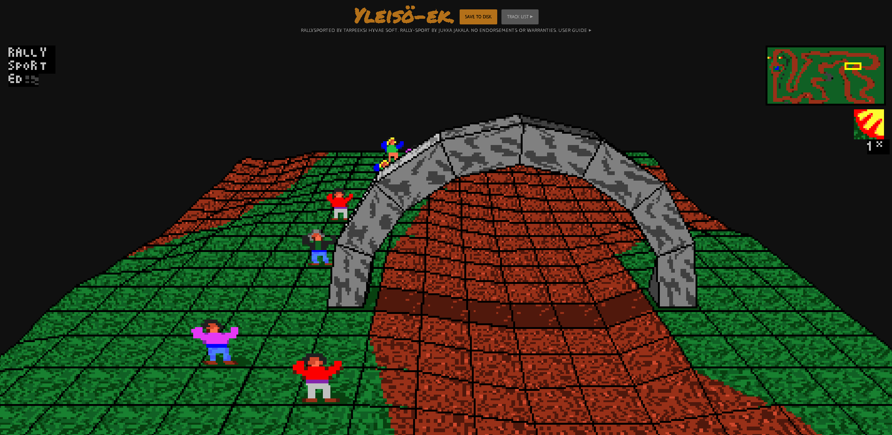

# RallySportED-JS
A version of [RallySportED](../../../rallysported)'s track editor for browsers, written in JavaScript. You should find it capable of running in a modern browser on a desktop system. Mobile support is on the cards but not yet available.

You can find more information about RallySportED in general, including more technically-oriented documentation, in [RallySportED's umbrella repo](../../../rallysported).

A live page of RallySportED-JS is available [here](http://tarpeeksihyvaesoft.com/rallysported/).

### Features!
- Edit Rally-Sport's tracks in your browser!
- Change the heightmap, paint the ground, move and place 3d objects
- Software-rendered 3d graphics with chunky pixels, just like in the game
- Written in vanilla JavaScript

# How to use
### User's guide
You can find the RallySportED-JS  user's guide by following the _User guide_ link at the top of the editor's page.

The guide will walk you through the basics of getting started with RallySportED-JS, making a new track from scratch, and playing the tracks in Rally-Sport. 

### Setting up on a server
If you want to set up RallySportED-JS on a server, simply copy over the following files:
- [index.php](index.php) and [index.css](index.css)
- The contents of the [js/](js/), [assets/](assets/), [track-list/](track-list/) directories

You can use the address parameter `track` to have RallySportED-JS load a particular track on page load. For instance, `?track=abc` will load the sample track `abc.zip` from [track-list/files/](track-list/files/).

# Project status
RallySportED-JS is currently in beta, with development occurring in sporadic increments.

You can check out the [to-do list](#to-do) to get a rough idea of what's to come for the project in the nearest future.

### System requirements
**User interface.** At present, a mouse and keyboard are required to operate the RallySportED-JS user interface. There are plans to implement a mobile-friendly UI, but no concrete schedule exists for it at this time.

**Processing power.** RallySportED-JS uses a software 3d renderer, so it requires a little bit of processing power from the host CPU. No specific figures have yet been established, but a reasonable desktop CPU released in the last five years or so should be up to the job. GPU performance is less important.

**Browser compatibility.** Below are rough estimates of the required browser versions to run a given version of RallySportED-JS. Browsers marked with "No" are not compatible at all.

<table>
    <tr>
        <th align="left" width="110"></th>
        <th align="center" width="90">
            
             Chrome
        </th>
        <th align="center" width="90">
            
             Firefox
        </th>
        <th align="center" width="90">
            
             Opera
        </th>
        <th align="center" width="90">
            
             Safari
        </th>
        <th align="center" width="90">
            
             Edge
        </th>
        <th align="center" width="90">
            
             IE
        </th>
    </tr>
    <tr>
        <td align="left">beta.3</td>
        <td align="center">46</td>
        <td align="center">27</td>
        <td align="center">37</td>
        <td align="center">8?</td>
        <td align="center">12?</td>
        <td align="center">No</td>
    </tr>
</table>

### Known issues
- [ ] Middle mouse button clicks, used to paint the terrain, may intermittently stop being registered
- [ ] The paint view may be slow to draw, as it's sloppily implemented
- [ ] There are occasional rendering glitches in the 3d view
- [ ] The house prop has bad texturing
- [ ] Keyboard keys can stick if released while the app doesn't have focus
- [ ] The camera moves in units of tiles rather than pixels, so scrolling can be jerky

### To-do
- [ ] Edit textures
- [ ] A user interface that works on mobile
- [ ] Highlight prop locations in the paint view
- [ ] Have the height of water tiles reflect how the game displays them
- [ ] Non-FPS-sensitive terrain editing
- [ ] Move the camera by clicking on the minimap
- [ ] Terrain shading
- [ ] An indicator rectangle in the texture pane around the texture that's currently selected

# Authors and credits
The principal author of RallySportED-JS is the one-man Tarpeeksi Hyvae Soft (see on [GitHub](https://github.com/leikareipa) and the [Web](http://www.tarpeeksihyvaesoft.com)).

The implementation of the Bresenham line algo in [js/rsed/render/line-draw.js](js/rsed/render/line-draw.js) has been adapted, with changes, from the one given by [Phrogz](https://stackoverflow.com/users/405017/phrogz) on [Stack Overflow](https://stackoverflow.com/a/4672319).

The browser icons used in the Browser compatibility section, above, come from [alrra](https://github.com/alrra)'s [Browser Logos](https://github.com/alrra/browser-logos) repository.
