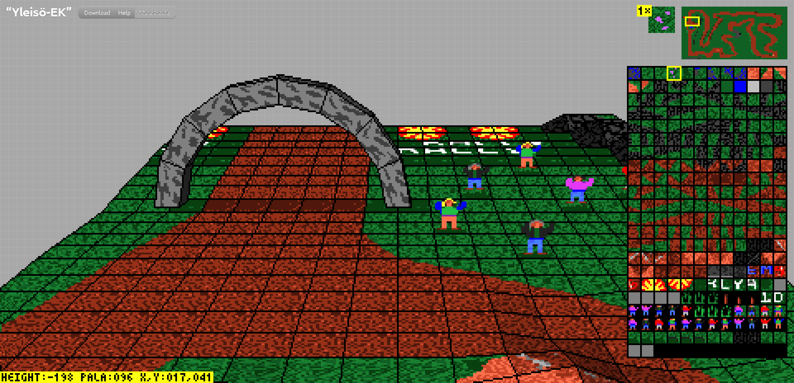

# RallySportED-js
A version of [RallySportED](https://github.com/leikareipa/rallysported/)'s track editor for browsers. You can find it running live [here](https://www.tarpeeksihyvaesoft.com/rallysported/).

### Features
- Create and edit Rally-Sport tracks in your browser
- Genuine olden software-rendered 3d graphics
- Vanilla JavaScript (+ a bit of Vue for the UI)



# End-user's guide
An end-user's guide is provided in the [rallysported-js/user-guide/](rallysported-js/user-guide/) directory; and hosted live [here](https://www.tarpeeksihyvaesoft.com/rallysported/user-guide/).

The guide walks you through the steps to creating a new track and getting it up and running in Rally-Sport.

# Developer's guide
If you'd like to modify RallySportED-js or otherwise inspect its internals, this guide is for you.

## Setting up RallySportED-js on a server
To set up RallySportED-js on your server, simply copy over the [distributable/](distributable/) directory. The app is client-based and doesn't need dynamic hosting.

- You can rename the `distributable` directory however you want, but its internal structure should remain as-is.

You should now be able to run RallySportED-js in a browser by navigating to where you placed the files on your server, such that [rallysported-js/index.html](rallysported-js/index.html) is served.

By default, the app will load Rally-Sport's track #4, from [rallysported-js/client/assets/tracks/demo-4.json](rallysported-js/client/assets/tracks/demo-4.json). For information on how to load a different track, see the [end user's guide](#end-users-guide). To find out more about RallySportED's data formats, see the [data formats](#data-formats) section.

## Data formats
### Rally-Sport's track data
The game stores its track data in discrete binary files. For instance, the following files are associated with track #1 ("Nurtsi cruising"):

| File         | Description                                              |
|--------------|----------------------------------------------------------|
| MAASTO.001   | The track's heightmap.                                   |
| VARIMAA.001  | The track's tilemap (texture indices for the PALAT file).|
| KIERROS1.DTA | The racing line for the track's CPU opponent.            |
| PALAT.001    | A texture atlas referred to by the track's tilemap.      |
| TEXT1.DTA    | A texture atlas for track-side 3d objects (trees, etc.). |
| ANIMS.DTA    | A texture atlas for animations (tire smoke, etc.).       |

More information about Rally-Sport's data formats is available in [RallySportED's technical documentation](https://github.com/leikareipa/rallysported/tree/master/docs).

### RallySportED's project data
Tracks made using RallySportED are called *projects*. Each project is a single Rally-Sport track that is playable in-game with the [RallySportED Loader](https://github.com/leikareipa/rallysported-dos/tree/master/modules/rload) utility.

A project's data are spread across the following files (`NAME` to be replaced by the project's name):

| File                  | Known as  | Description                                       |
|-----------------------|-----------|-------------------------------------------------------|
| NAME/NAME.DTA         | Container | The track's data files concatenated into one. |
| NAME/NAME.$FT         | Manifesto | Parameters for loading the track into Rally-Sport.    |
| NAME/HITABLE.TXT      | Hi-table  | The track's record lap times.                            |

#### Container file

The container file contains the project's Rally-Sport track files concatenated into a single file. Each track file is stored in the container as a block of bytes preceded by a 32-bit header value indicating the block's length in bytes.

From start to finish, the container's byte layout is the following:

| Header  | Data block          |
|---------|---------------------|
| 32b *n* | 8b * *n*: `MAASTO`  |
| 32b *n* | 8b * *n*: `VARIMAA` |
| 32b *n* | 8b * *n*: `PALAT`   |
| 32b *n* | 8b * *n*: `ANIMS`   |
| 32b *n* | 8b * *n*: `TEXT`    |
| 32b *n* | 8b * *n*: `KIERROS` |

If you wanted to extract e.g. the VARIMAA file, you'd read the first value of *n*, skip the next *n* bytes, read the next value of *n*, and output the next *n* bytes.

#### Manifesto file

Rally-Sport hard-codes certain track-related parameters in its executables. Playing RallySportED-made tracks requires some of these hard-coded parameters to be modified at load-time.

A project's manifesto file tells the [RallySportED Loader](https://github.com/leikareipa/rallysported-dos/tree/master/modules/rload) utility &ndash; whose job it is to load RallySportED tracks into the game &ndash; how the hard-coded parameters should be modified for this particular track.

*(Coming: A more in-depth description of the manifesto file.)*

### RallySportED-js's JSON track format
For convenience, RallySportED-js stores the original Rally-Sport tracks &ndash; converted into RallySportED projects &ndash; in a JSON wrapper, which provides room for additional metadata. You can find examples of these JSON track files in the [rallysported-js/client/assets/tracks/](rallysported-js/client/assets/tracks/) directory.

A JSON track file has the following format:

```json
[{
    "container": "The container file's data as a Base64-encoded string",
    "manifesto": "The manifesto file's data as a plain string",
    "meta": {
        "internalName": "DEMOA",
        "displayName": "Nurtsi-cruising",
        "width": 64,
        "height": 64
    }
}]
```

The `internalName` property holds the project's base RallySportED name. This is the name by which the project's container and manifesto files are called, and is limited to at most eight characters in the ASCII A-Z range.

The `displayName` property provides a name by which the project is referred to in the RallySportED-js UI. Since this string is not limited in length or character set, it can be more descriptive than the base `internalName` one. However, it's not supported by the rest of the RallySportED toolset and so is lost when the track is exported into the normal RallySportED project format.

The `width` and `height` properties describe the track's dimensions.

## The software 3D renderer
RallySportED-js uses the [retro n-gon renderer](https://www.github.com/leikareipa/retro-ngon/) to reproduce the original look of Rally-Sport in the 3d track editor.

The retro n-gon renderer - forked from RallySportED-js's original renderer, developed into a standalone renderer, then backported into RallySportED-js - is a custom software 3d engine capable of natively rendering Rally-Sport's *n*-sided polygons onto a HTML5 canvas.

Below is a 3d model of a rock from the game as rendered in RallySportED-js. Its mesh consists of four- and five-sided polygons that were rasterized directly without intervening triangulation.


The renderer also reproduces Rally-Sport's somewhat quirky style of texture-mapping, where texture coordinates are derived from the screen-space coordinates of the polygon's vertices; resulting in noticeable warping of the texture dependent on e.g. the viewing angle.

Below is a series of images of a texture-mapped polygon demonstrating the texture-warping effect. The upper-right vertex of the polygon is successively raised, resulting in progressively increasing warping of the texture.


To see why this happens, consider that the texture's *v* coordinate is derived from the polygon's height in screen space so that *v* equals 0 at the highest vertex and 1 at the lowest vertex; and the *u* coordinate from the length of each horizontal pixel span of the polygon on-screen so that *u* equals 0 at the left end of the span and 1 at the right end.

# Project status
RallySportED-js is currently in beta, with development occurring in sporadic increments.

## System requirements
A mouse and keyboard are required to operate the RallySportED-js UI. There are plans to implement a mobile-friendly UI, but no schedule exists for it at this time.

As RallySportED-js uses a software 3d renderer, it requires a bit of extra CPU processing power compared to a normal web app. A mid-range desktop PC bought in the last five years or so combined with a well-optimized browser like Google Chrome should run it fine.

## System compatibility
Generally speaking, RallySportED-js tends to work best - and is most tested - in Google Chrome.

Below are rough estimates of the required browser versions to run a given version of RallySportED-js. Browsers marked with "No" are not compatible at all.

<table>
    <tr>
        <th align="left" width="110"></th>
        <th align="center" width="90">
            
            <br>Chrome
        </th>
        <th align="center" width="90">
            
            <br>Firefox
        </th>
        <th align="center" width="90">
            
            <br>Opera
        </th>
        <th align="center" width="90">
            
            <br>Safari
        </th>
        <th align="center" width="90">
            
            <br>Edge
        </th>
        <th align="center" width="90">
            
            <br>IE
        </th>
    </tr>
    <tr>
        <td align="left">pre-beta.4</td>
        <td align="center">64</td>
        <td align="center">48</td>
        <td align="center">51</td>
        <td align="center">11</td>
        <td align="center">15</td>
        <td align="center" style="text-decoration: underline wavy crimson;">No</td>
    </tr>
    <tr>
        <td align="left">beta.3</td>
        <td align="center">46</td>
        <td align="center">27</td>
        <td align="center">37</td>
        <td align="center">8</td>
        <td align="center">12</td>
        <td align="center" style="text-decoration: underline wavy crimson;">No</td>
    </tr>
</table>

Below is a table of the OS/browser combinations the author has tested RallySportED-js with and whether the combination worked.

- Note: The RallySportED-js UI is intended for larger (tablet or PC) screens and to be controlled with a mouse and keyboard. Even if the table below indicates that the app works on a particular mobile platform, you may not find its usability to be adequate on such devices.

<table>
    <tr>
        <th align="left" width="110"></th>
        <th align="center" width="90">
            
            <br>+<br>
            
            
        </th>
        <th align="center" width="90">
            
            <br>+<br>
            
        </th>
        <th align="center" width="90">
            
            <br>+<br>
            
        </th>
    </tr>
    <tr>
        <td align="left">web-beta.6</td>
        <td align="center">Yes</td>
        <td align="center">Yes</td>
        <td align="center" style="text-decoration: underline wavy crimson;">No*</td>
    </tr>
    <tr>
        <td align="left">web-beta.5</td>
        <td align="center">Yes</td>
        <td align="center">Yes</td>
        <td align="center">Yes?</td>
    </tr>
</table>

\* Tested on an iPad (iPadOS). The in-canvas UI doesn't load (possibly a problem with the use of JavaScript's `include()`); and pressing the HTML UI's "Download" button doesn't seem to do anything.

# Authors and credits
The principal author of RallySportED-js is the one-man Tarpeeksi Hyvae Soft (see on [GitHub](https://github.com/leikareipa) and the [Web](https://www.tarpeeksihyvaesoft.com)).

RallySportED-js makes use of [JSZip](https://stuk.github.io/jszip/) and [FileSaver.js](https://github.com/eligrey/FileSaver.js).

The implementation of the Bresenham line algo in [js/rallysported/render/line-draw.js](js/rallysported/render/line-draw.js) has been adapted, with changes, from the one given by [Phrogz](https://stackoverflow.com/users/405017/phrogz) on [Stack Overflow](https://stackoverflow.com/a/4672319).

The browser icons used in the [Browser compatibility](#browser-compatibility) section come from [alrra](https://github.com/alrra)'s [Browser Logos](https://github.com/alrra/browser-logos) repository. Their use here is purely for visual effect and carries no implication of endorsement, certification, etc.

The OS icons used in the [Browser compatibility](#browser-compatibility) section come from [EgoistDeveloper](https://github.com/EgoistDeveloper)'s [operating-system-logos](https://github.com/EgoistDeveloper/operating-system-logos) repository. Their use here is purely for visual effect and carries no implication of endorsement, certification, etc.
