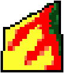

# RallySportED-js
A version of [RallySportED](https://github.com/leikareipa/rallysported/)'s track editor for browsers, written in JavaScript.

A live page running RallySportED-js is available [here](https://www.tarpeeksihyvaesoft.com/rallysported/). It loads up a track in your browser for local editing.

### Features in RallySportED-js
- Create and edit tracks for Rally-Sport in your browser!
- Genuine olden-style software-rendered 3d graphics
- Written in modern, vanilla JavaScript - with a bit of Vue for the UI


# End-user's guide
You can find a handy end-user's guide at https://www.tarpeeksihyvaesoft.com/rallysported/user-guide/.

The guide walks you through the steps to create a custom track, and shows you how to get the track running in Rally-Sport.

## Setting up RallySportED-js on a server
To set up a copy of RallySportED-js on your own server, simply copy over the files from the [rallysported-js/](rallysported-js/) directory.

- The destination folder on your server does not need to be named rallysported-js - only the directory structure inside it must reflect the contents of [rallysported-js/](rallysported-js/).
- From [rallysported-js/client/js/](rallysported-js/client/js/), you only need to copy [rallysported.cat.js](rallysported-js/client/js/rallysported.cat.js), which is a concatenation of the source files under that directory (built using the [build-client-distributable.sh](build-client-distributable.sh) script).

You should now be able to run RallySportED-js in your browser by navigating to where you placed the files on your server - assuming the server then serves the [rallysported-js/index.php](rallysported-js/index.php) file as per usual.

By default, RallySportED-js will load Rally-Sport's track #4 as stored in RallySportED's project format under `server/assets/tracks/demod/`. You can see the end-user's guide for more information about accessing different tracks, and the [Technical details](#technical-details) section of this document for the specifics of RallySportED's project files.

# Technical details
Rally-Sport stores most of its asset data in fairly straightforward binary files; and RallySportED-js provides structured means to edit these data.

For instance, the following asset files are involved with the game's first track, "Nurtsi cruising":

| File         | Contains                                                 |
|--------------|----------------------------------------------------------|
| MAASTO.001   | The track's heightmap.                                   |
| VARIMAA.001  | The track's tilemap (texture indices for the PALAT file).|
| KIERROS1.DTA | The racing line for the track's CPU opponent.            |
| PALAT.001    | A texture atlas referred to by the track's tilemap.      |
| TEXT1.DTA    | A texture atlas for track-side 3d objects (trees, etc.). |
| ANIMS.DTA    | A texture atlas for animations (tire smoke, etc.).       |

In addition, a small amount of data is hard-coded into the RALLYE.EXE executable; for instance, the locations of track-side 3d objects.

RallySportED-js provides a 3d view that combines the data from a given track's MAASTO and VARIMAA files - as well as some of the hard-coded data from RALLYE.EXE - to allow the user to modify the track's appearance and surface features.

For more in-depth information about Rally-Sport's data formats, see [RallySportED's technical documentation](https://github.com/leikareipa/rallysported/tree/master/docs).

## What's a RallySportED project?
Tracks created with RallySportED are called *projects*. A project holds the data of exactly one Rally-Sport track, in a format specific to RallySportED.

A project called "Suorundi", for example, would consist of the following files (the files of a project are always placed inside a folder named after the project):

| File                  | Contains                                                                        |
|-----------------------|---------------------------------------------------------------------------------|
| SUORUNDI/SUORUNDI.DTA | All of the track's Rally-Sport data concatenated into one file. |
| SUORUNDI/SUORUNDI.$FT | Parameters for loading the project's track into Rally-Sport.    |

RallySportED-js adds an extra file not present in other versions of RallySportED:

| File                  | Contains                                                                        |
|-----------------------|---------------------------------------------------------------------------------|
| SUORUNDI/SUORUNDI.META.JSON | Server-side metadata about the track. |

### The container file

The container (.DTA) file contains all of the track's data (MAASTO, VARIMAA, KIERROS, etc.) concatenated into one file.

The container file has the following byte layout:

| Header     | File segment           |
|------------|------------------------|
| 32-bit *n* | 8-bit * *n*: `MAASTO`  |
| 32-bit *n* | 8-bit * *n*: `VARIMAA` |
| 32-bit *n* | 8-bit * *n*: `PALAT`   |
| 32-bit *n* | 8-bit * *n*: `ANIMS`   |
| 32-bit *n* | 8-bit * *n*: `TEXT`    |
| 32-bit *n* | 8-bit * *n*: `KIERROS` |

Although not required to do so, the container file (more specifically, the KIERROS file inside it) will usually end with the 8-byte value 0xFFFFFFFF.

### The manifesto file

Since each track in Rally-Sport relies on some hard-coded parameters that are not stored in external asset files, loading custom-made track requires modifying the Rally-Sport executable.

To achieve this, RallySportED uses a loader program. The loader takes instructions from the manifesto (.$FT) file on how to modify the game's hard-coded parameters so that the track is loaded in properly.

*(Coming: A table of the manifesto file commands.)*

### The metadata file
RallySportED-js's server-side metadata file (.META.JSON) is a helper file for server-side code, providing convenient information about the track not readily available in the project's other files.

The metadata file has the following contents:

```json
{
    "internalName": "name",
    "displayName": "Nomen est omen",
    "width": 128,
    "height": 128
}
```

The `internalName` property defines the name by which the project is identified by RallySportED. The name is limited to ASCII A-Z and can be at most eight characters long. When you import or export a project to/from RallySportED-js, this is the name that will be used.

The `displayName` property provides a name by which the project is referred in RallySportED-js's user-facing UI. This string is not limited in length or character set, as such, but will not be available outside of RallySportED-js.

The `width` and `height` properties tell how many tiles per side the track has. Note that these properties do not define the track's dimensions but only describe them.

## The client and the server
*(Coming.)*

## The software 3d renderer
RallySportED-js uses the [retro n-gon renderer](https://www.github.com/leikareipa/retro-ngon/) to reproduce the original look of Rally-Sport in the 3d track editor.

The retro n-gon renderer - forked from RallySportED-js's original renderer, developed into a standalone renderer, then backported into RallySportED-js - is a custom software 3d engine capable of natively rendering Rally-Sport's *n*-sided polygons onto a HTML5 canvas.

Below is a 3d model of a rock from the game as rendered in RallySportED-js. Its mesh consists of four- and five-sided polygons that were rasterized directly without intervening triangulation.


The renderer also reproduces Rally-Sport's somewhat quirky style of texture-mapping, where texture coordinates are derived from the screen-space coordinates of the polygon's vertices; resulting in noticeable warping of the texture dependent on e.g. the viewing angle.

Below is a series of images of a texture-mapped polygon demonstrating the texture-warping effect. The upper-right vertex of the polygon is successively raised, resulting in progressively increasing warping of the texture.




To see why this happens, consider that the texture's *v* coordinate is derived from the polygon's height in screen space so that *v* equals 0 at the highest vertex and 1 at the lowest vertex; and the *u* coordinate from the length of each horizontal pixel span of the polygon on-screen so that *u* equals 0 at the left end of the span and 1 at the right end.

# Project status
RallySportED-js is currently in beta, with development occurring in sporadic increments.

## System requirements
A mouse and keyboard are required to operate the RallySportED-js UI. There are plans to implement a mobile-friendly UI, but no schedule exists for it at this time.

As RallySportED-js uses a software 3d renderer, it requires a bit of extra CPU processing power compared to a normal web app. A mid-range desktop PC bought in the last five years or so combined with a well-optimized browser like Google Chrome should run it fine.

## Browser compatibility
Although compatible with a number of browsers, RallySportED-js tends to work best - and is most tested - in Google Chrome.

Below are rough estimates of the required browser versions to run a given version of RallySportED-js. Browsers marked with "No" are not compatible at all.

<table>
    <tr>
        <th align="left" width="110"></th>
        <th align="center" width="90">
            
            <br>Chrome
        </th>
        <th align="center" width="90">
            
            <br>Firefox
        </th>
        <th align="center" width="90">
            
            <br>Opera
        </th>
        <th align="center" width="90">
            
            <br>Safari
        </th>
        <th align="center" width="90">
            
            <br>Edge
        </th>
        <th align="center" width="90">
            
            <br>IE
        </th>
    </tr>
    <tr>
        <td align="left">pre-beta.4</td>
        <td align="center">64</td>
        <td align="center">48</td>
        <td align="center">51</td>
        <td align="center">11</td>
        <td align="center">15</td>
        <td align="center">No</td>
    </tr>
    <tr>
        <td align="left">beta.3</td>
        <td align="center">46</td>
        <td align="center">27</td>
        <td align="center">37</td>
        <td align="center">8</td>
        <td align="center">12</td>
        <td align="center">No</td>
    </tr>
</table>

# Authors and credits
The principal author of RallySportED-js is the one-man Tarpeeksi Hyvae Soft (see on [GitHub](https://github.com/leikareipa) and the [Web](https://www.tarpeeksihyvaesoft.com)).

RallySportED-js makes use of [JSZip](https://stuk.github.io/jszip/) and [FileSaver.js](https://github.com/eligrey/FileSaver.js).

The implementation of the Bresenham line algo in [js/rallysported/render/line-draw.js](js/rallysported/render/line-draw.js) has been adapted, with changes, from the one given by [Phrogz](https://stackoverflow.com/users/405017/phrogz) on [Stack Overflow](https://stackoverflow.com/a/4672319).

The browser icons used in the [Browser compatibility](#browser-compatibility) section come from [alrra](https://github.com/alrra)'s [Browser Logos](https://github.com/alrra/browser-logos) repository.
