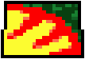

**Note!** The master branch currently contains an on-going rewrite of sections of the codebase, and may be considered unstable for the time being. The rewrite begins with commit f6acac08822a17540407af8998b67537bbd154d0 (roughly speaking).

# RallySportED-js
A version of [RallySportED](https://github.com/leikareipa/rallysported/)'s track editor for browsers, written in JavaScript. You should find it capable of running in a modern browser on a desktop system. (Mobile support is on the cards but not yet available.)

You can find more information about RallySportED in general, including more technically-oriented documentation, in [RallySportED's umbrella repo](https://github.com/leikareipa/rallysported/).

A live page running RallySportED-js is available [here](http://tarpeeksihyvaesoft.com/rallysported/) - it loads up a track in your browser for local editing. Alternately, you can check out [this version](http://tarpeeksihyvaesoft.com/rallysported/?shared=xcrbdyb), which demonstrates shared editing - changes you make to the track are dynamically sent to the server and broadcast to others viewing the page, and vice versa. (Note that the shared version is publically available but generally uncurated. I encourage users' creativity, but can't guarantee that the content they produce is at all times appropriate for all occasions.)

### Features!
- Edit Rally-Sport's tracks in your browser!
- Alter the heightmap, paint the ground, move and place 3d objects
- Real-time shared editing via the internet
- Software-rendered 3d graphics with chunky pixels, just like in Rally-Sport
- Written in vanilla JavaScript (with a bit of Vue sprinkled in for the UI)

# Technical matters
*(Coming.)*

## Rally-Sport
Rally-Sport is a racing game released by Jukka Jäkälä in 1996 for DOS-based computers; featuring fun, tongue-in-cheek rallying in fully 3d environments. Its original website is available [via archive.org](https://web.archive.org/web/19970805142345/http://www.cs.tut.fi/~k140734/Rally-Sport/index.html).

Although no official modding tools were released for the game, many of its assets are stored in straightforward binary formats, making them readily moddable. Further technical information about Rally-Sport's assets and their data formats are available under the [docs/](https://github.com/leikareipa/rallysported/tree/master/docs) folder in [RallySportED's umbrella repo](https://github.com/leikareipa/rallysported/).

## RallySportED
*(Coming.)*

### Projects
Tracks created with RallySportED are called *projects*; each project holding the data of one modded track.

For example, given a project entitled "Suorundi", it would consists of the following two files:

- Suorundi.dta
- Suorundi.$ft

The `dta` file (also called the project's `container`) holds the various modded Rally-Sport assets that make up the project's track - like the heightmap, tilemap, and textures.

The `$ft` file (also called the project's `manifesto`) is a plain ASCII file giving additional directives to RallySportED on how to modify certain hard-coded parameters in Rally-Sport for the purposes of the project's track - such as to adjust the colors of the palette that Rally-Sport uses to render the track.

#### The project's container file
The container file gets its name from the fact that it consists of a number of discrete asset files. The following individual asset files are contained in a project's .dta file:

| Asset     | Description                                            |
| --------- | ------------------------------------------------------ |
| `Maasto`  | The track's heightmap.                                 |
| `Varimaa` | The track's tilemap.                                   |
| `Palat`   | The tilemap's texture atlas (~256 16-by-16 textures).  |
| `Anims`   | Animation frames (of things like fire and tire smoke). |
| `Text`    | Textures of track-side props (3d objects, like trees). |
| `Kierros` | The racing line of the track's AI.                     |

The asset names derive directly from the names of the corresponding data files in Rally-Sport. To learn more about the internals of Rally-Sport's asset files, see [RallySportED's documentation on Rally-Sport's data formats](https://github.com/leikareipa/rallysported/blob/master/docs/rs-formats.txt).

The assets are laid out in the container file in a straightforward manner. The first four bytes of the container give as a little-endian 32-bit unsigned integer the byte size *n* of the `Maasto` data. The following *n* bytes are the `Maasto` data. The next four bytes give as a 32-bit unsigned integer the byte size *n* of the `Varimaa` data, and the following *n* bytes are the `Varimaa` data. This pattern repeats in the order given in the table, above; such that `Maasto` is the first contained asset and `Kierros` is the last. There is no data compression or the like - the individual assets are stored 1:1 with Rally-Sport's formats.

#### The project's manifesto file
*(Coming.)*

### Renderer
RallySportED-js uses the [retro n-gon renderer](https://www.github.com/leikareipa/retro-ngon/) to faithfully reproduce the look of Rally-Sport in the editor.

The retro n-gon renderer - forked from RallySportED-js's original renderer, developed into a standalone renderer, then backported into RallySportED-js - is a custom software 3d engine capable of natively rendering Rally-Sport's *n*-sided polygons into a HTML5 canvas.

Below is a 3d model of a rock from the game as rendered in RallySportED-js. Its mesh consists of four- and five-sided polygons that were rasterized directly without intervening triangulation.

The renderer also reproduces Rally-Sport's somewhat quirky style of texture-mapping, where texture coordinates are derived at render-time from the screen-space coordinates of the polygon's vertices; resulting in noticeable warping of the texture dependent on e.g. the viewing angle.

Below is a series of images of a texture-mapped polygon demonstrating the texture-warping effect. The upper-right vertex of the polygon is successively raised, resulting in progressively increasing warping of the texture.

To explain why this happens, consider that the texture's *v* coordinate is derived from the polygon's height in screen space, such that *v* equals 0 at the highest vertex and 1 at the lowest vertex; and the *u* coordinate from the length of each horizontal pixel span of the polygon on-screen, such that *u* equals 0 at the left end of the span and 1 at the right end.

As a result, in the right-most image above, nearly half of the texture is mapped onto the raised triangular region at the top of the polygon, and becomes more and more squished horizontally toward the polygon's peak, where the horizontal pixels spans are ever shorter.

### Client and server
*(Coming.)*

## The codebase
*(Coming.)*

# How to use
### User's guide
You can find the RallySportED-js  user's guide by following the _User guide_ link at the top of the editor's page.

The guide will walk you through the basics of getting started with RallySportED-js, making a new track from scratch, and playing the tracks in Rally-Sport. 

### Setting up on a server
To set up RallySportED-js on a server, simply copy over the following items:
- [index.php](index.php)
- [index.css](index.css)
- The [server/](server/) directory
- The [client/](client/) directory
    - From [client/js/](client/js/), only [client/js/rallysported.cat.js](client/js/rallysported.cat.js) is required

You can use the address parameter `track` to instruct RallySportED-js on which track to load up. For instance, `?track=abc` will load the sample track `abc` from [server/assets/tracks/local/abc](server/assets/tracks/local/abc). (Other parameters are also available; these will be documented in the near future.)

# Project status
RallySportED-js is currently in beta, with development occurring in sporadic increments.

You can check out the [to-do list](#to-do) to get a rough idea of what's to come for the project in the nearest future.

### System requirements
**User interface.** At present, a mouse and keyboard are required to operate the RallySportED-js user interface. There are plans to implement a mobile-friendly UI, but no concrete schedule exists for it at this time.

**Processing power.** RallySportED-js uses a software 3d renderer, so it requires a little bit of processing power from the host CPU. No specific figures have yet been established, but a reasonable desktop CPU released in the last five years or so should be up to the job. GPU performance is less important.

**Browser compatibility.** Below are rough estimates of the required browser versions to run a given version of RallySportED-js. Browsers marked with "No" are not compatible at all.

<table>
    <tr>
        <th align="left" width="110"></th>
        <th align="center" width="90">
            
             Chrome
        </th>
        <th align="center" width="90">
            
             Firefox
        </th>
        <th align="center" width="90">
            
             Opera
        </th>
        <th align="center" width="90">
            
             Safari
        </th>
        <th align="center" width="90">
            
             Edge
        </th>
        <th align="center" width="90">
            
             IE
        </th>
    </tr>
    <tr>
        <td align="left">pre-beta.4</td>
        <td align="center">64</td>
        <td align="center">48</td>
        <td align="center">51</td>
        <td align="center">11?</td>
        <td align="center">15?</td>
        <td align="center">No</td>
    </tr>
    <tr>
        <td align="left">beta.3</td>
        <td align="center">46</td>
        <td align="center">27</td>
        <td align="center">37</td>
        <td align="center">8?</td>
        <td align="center">12?</td>
        <td align="center">No</td>
    </tr>
</table>

### Known issues
- [ ] Middle mouse button clicks, used to paint the terrain, may intermittently stop being registered
- [ ] The paint view may be slow to draw, as it's sloppily implemented
- [ ] There are occasional rendering glitches in the 3d view
- [ ] The house prop has bad texturing
- [ ] Keyboard keys can stick if released while the app doesn't have focus
- [ ] The camera moves in units of tiles rather than pixels, so scrolling can be jerky

### To-do
- [ ] Edit textures
- [ ] A user interface that works on mobile
- [ ] Highlight prop locations in the paint view
- [ ] Have the height of water tiles reflect how the game displays them
- [ ] Non-FPS-sensitive terrain editing
- [ ] Move the camera by clicking on the minimap
- [ ] Terrain shading
- [ ] An indicator rectangle in the texture pane around the texture that's currently selected

# Authors and credits
The principal author of RallySportED-js is the one-man Tarpeeksi Hyvae Soft (see on [GitHub](https://github.com/leikareipa) and the [Web](http://www.tarpeeksihyvaesoft.com)).

RallySportED-js makes use of [JSZip](https://stuk.github.io/jszip/) and [FileSaver.js](https://github.com/eligrey/FileSaver.js).

The implementation of the Bresenham line algo in [js/rallysported/render/line-draw.js](js/rallysported/render/line-draw.js) has been adapted, with changes, from the one given by [Phrogz](https://stackoverflow.com/users/405017/phrogz) on [Stack Overflow](https://stackoverflow.com/a/4672319).

The browser icons used in the Browser compatibility section, above, come from [alrra](https://github.com/alrra)'s [Browser Logos](https://github.com/alrra/browser-logos) repository.
